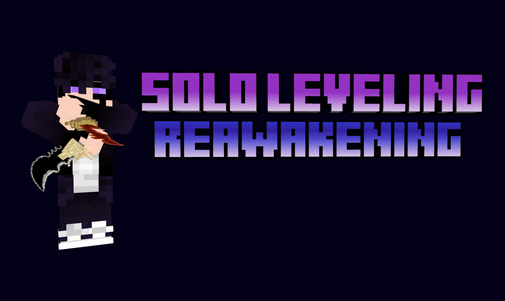

<p align="center">
  
</p>

<h1 align="center">Solo Craft: Reawakening</h1>

<p align="center">
  A Solo Leveling-inspired progression mod for Minecraft.
</p>

<p align="center">
  
  
  
  
</p>

Solo Craft: Reawakening is a fan-made Forge mod built around the feeling of growing from a low-rank hunter into something much stronger. Clear gates, improve your stats, learn new skills, face job-change trials, and choose the power you want to carry.

The mod is still in active development. Some parts are polished and some are still changing, so back up important worlds before updating.

## What's inside

- **Hunter progression** — gain levels, spend stat points, climb the ranks, earn titles, and unlock stronger skills.
- **Classes and jobs** — begin with a combat class, then take on job-change content and pursue Ruler or Monarch powers.
- **Ranked gates and dungeons** — enter gates from E-rank to S-rank, fight through dungeon encounters, and claim their rewards.
- **Weapons and abilities** — use daggers, swords, bows, magic, class skills, and job abilities with their own effects and cooldowns.
- **Enemies and bosses** — face familiar creatures, hunters, and bosses across regular gates, Red Gates, the Cartenon Temple, and the Demon King's Castle.
- **Shadow progression** — extract, store, summon, dismiss, and command shadows as your power grows.
- **Daily quests and the System** — manage stats, quests, rewards, skills, and party information from one panel.
- **Story Mode** — start with a guided single-player prologue instead of the normal opening.
- **Parties and world settings** — play gates with other hunters and tune progression, difficulty, death rules, and gate access for each world.
- **Dungeon Builder Studio** — build, test, and export custom dungeon datapacks from inside Minecraft.

## Requirements

| | Version |
| --- | --- |
| Minecraft | 1.20.1 |
| Forge | 47.2.0 |
| Java | 17 |
| GeckoLib | 4.4.2 |

[GeckoLib](https://www.curseforge.com/minecraft/mc-mods/geckolib) is required. Other supported integrations are optional.

## Installation

1. Install [Minecraft Forge 47.2.0](https://files.minecraftforge.net/net/minecraftforge/forge/index_1.20.1.html) for Minecraft 1.20.1.
2. Install GeckoLib 4.4.2 for Forge 1.20.1.
3. Place `SLR1.0.4.jar` and the GeckoLib jar in your `mods` folder.
4. Start Minecraft with the Forge profile.

For multiplayer, the server and every player need the same mod and dependency versions.

## Starting a world

World creation has a **Solo Leveling** tab where you can choose:

- Story Mode on or off;
- standard, fast, or custom progression;
- normal, hard, brutal, or custom difficulty;
- XP rate, job-change level, gate access, and death rules.

In a regular world, follow the first on-screen prompt and find an Evaluator. With Story Mode enabled, the prologue begins when you first join the world.

## Default controls

| Key | Action |
| --- | --- |
| `N` | Open the System panel |
| `R` | Cycle the selected skill |
| `Z` | Use the selected skill |
| `Tab` | Show quest information |
| `X` / `C` / `V` / `B` | Use job abilities |
| `1`–`8` | Use equipped skill slots |

All bindings can be changed under **Options → Controls → Solo Leveling Keybinds**.

## Dungeon Builder

The Dungeon Builder Studio is for addon and datapack creators. Create a **Dungeon Builder** world, enter Creative mode as an operator, and press `N` to open the Studio.

- [Dungeon Builder quick start](src/main/resources/docs/sololeveling/dungeon_builder_quickstart.md)

## Building from source

You need Git and JDK 17. The Gradle wrapper downloads the rest of the development setup.

```powershell
git clone https://github.com/Efkrdnz/SLR-Minecraft-Mod.git
cd SLR-Minecraft-Mod

.\gradlew.bat runClient
.\gradlew.bat build
```

On Linux or macOS, use `./gradlew` instead of `.\gradlew.bat`.

The finished mod is written to:

```text
build/libs/SLR1.0.4.jar
```

To start a development server or run the checks separately:

```powershell
.\gradlew.bat runServer
.\gradlew.bat check
```

## Contributing

Bug reports and focused pull requests are welcome. When reporting a problem, include:

- the mod, Forge, and GeckoLib versions;
- a short way to reproduce the issue;
- the relevant crash report or `latest.log`;
- any other mods installed at the time.

For large changes, please open an issue or talk about the idea in the Discord first.

## Links

- [Discord](https://discord.gg/U3RtGxd5uw)
- [Issue tracker](https://github.com/Efkrdnz/SLR-Minecraft-Mod/issues)
- [Source code](https://github.com/Efkrdnz/SLR-Minecraft-Mod)

## Credits

Created and developed by **Efkrdnz**.

Additional model credits found in the project assets include **wolf_awwent**, **T1nC4n**, and **Wulfy**.

## License and disclaimer

The project metadata declares **Apache License 2.0**.

This is an unofficial fan project. It is not affiliated with the creators or rights holders of Solo Leveling, Mojang Studios, or Microsoft.
